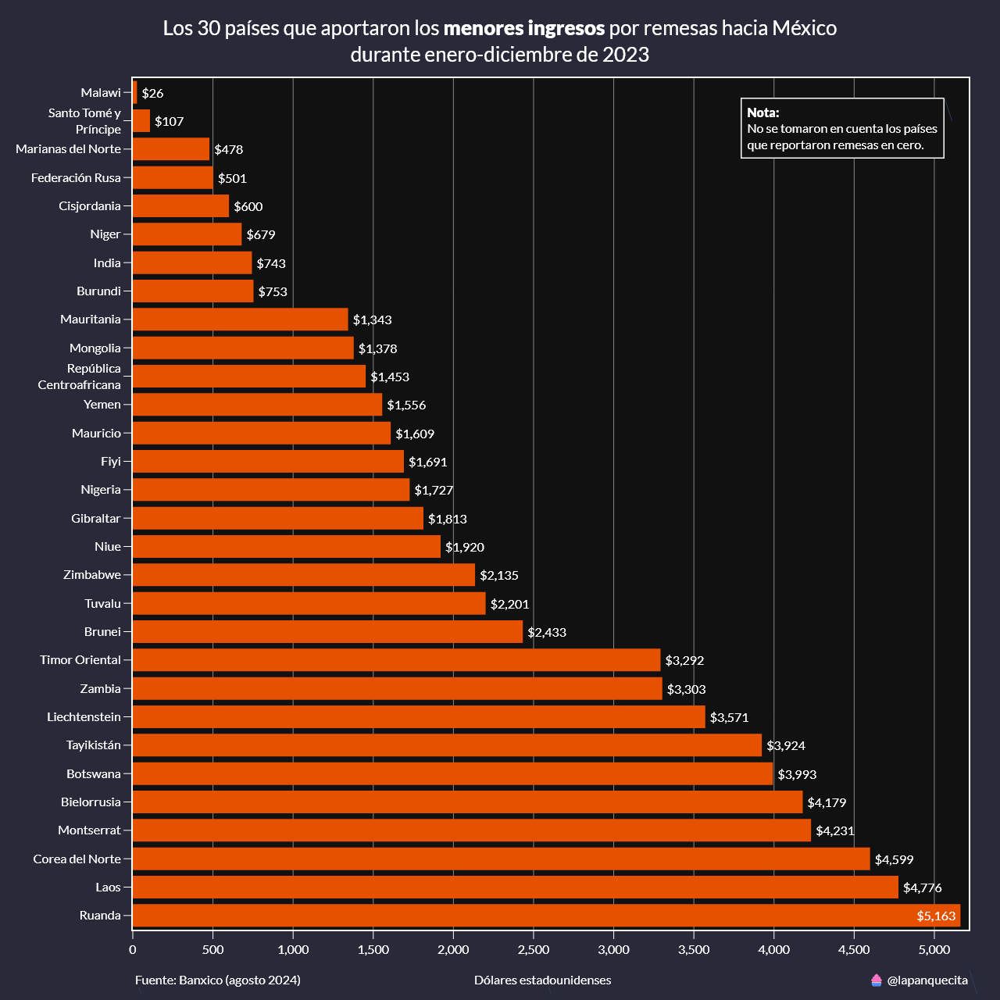
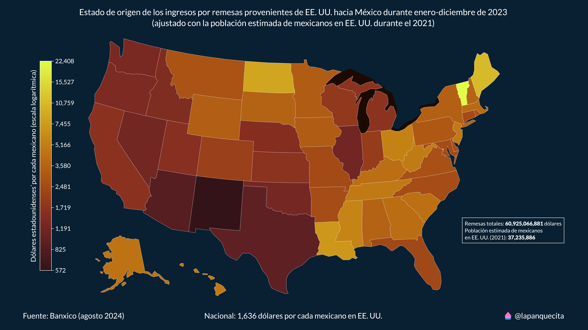
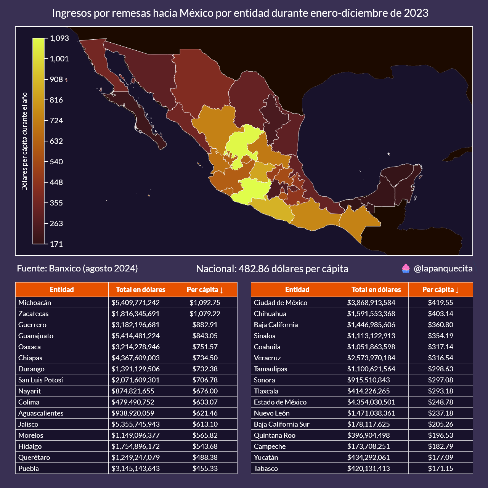
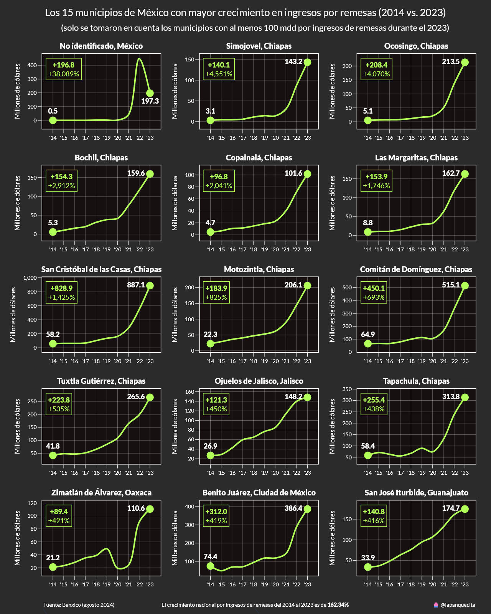
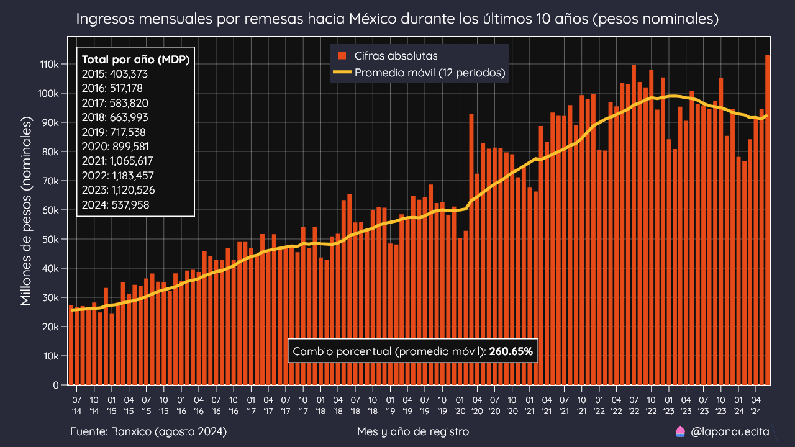
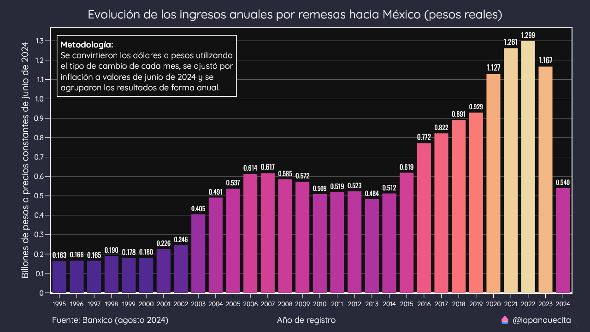

# Ingresos por remesas hacia México

Este repositorio contiene scripts para analizar todos los datasets que Banxico provee acerca de los ingresos por remesas hacia México.

Banxico provee la información en intervalos mensuales para los ingresor generales y en intervalos trimestrales para la información a nivel estatal, municipal y por país de origen.

Las cifras se encuentran en milllones de dólares estadounidenses nominales, esto quiere decir que son cifras sin ajustar por inflacioón ni tipo de cambio, estos ajustes son efectuados en sus respectivos scripts.

Las remesas son muy importantes en México, llegan a representar el único ingreso de las familias que los reciben. Las remesas han aumentado año tras año, sin embargo, hay tendencias que pasan desapercibidas para el público general y en este repositorio las estudiaremos a fondo.

## Remesas por país de origen

México recibe remesas de casi todos los países del mundo, sin embargo, EE. UU. es por mucho el que más aporta, con el 96.2% del total de estas.

En la siguiente gráfica de barras se muestran los 30 países que más envían remesas hacia México. Se tuvo que usar una escala logarítmica para poder hacer una mejor comparación, dada la gran diferencia de cifras.

Del otro lado tenemos a los 30 países que menos remesas aportan. En esta gráfica no se muestran porcentajes ya que todos se aproximan al 0%.

Por último, tenemos un mapa Choropleth con la distribución espacial. Se puede apreciar que la mayoría de las remesas provienen de América y Europa occidental. También se se hizo uso de una escala logarítmica para poder distribuir mejor las cifras.

## Remesas provenientes de EE. UU.

Como lo fue mencionado anteriormente, durante el 2023 EE. UU. aportó el 96.2% del total de las remesas hacia México.

Los 10 estados de EE. UU. que aportaron más remesas fueron:

| Estado     |         Total |
|:-----------|--------------:|
| California         | 20,694,926,098 |
| Texas              |  9,246,118,422 |
| Georgia            |  2,275,752,317 |
| Illinois           |  2,075,400,470 |
| Colorado           |  1,891,334,038 |
| Florida            |  1,855,241,458 |
| Arizona            |  1,747,921,085 |
| Nueva York         |  1,602,169,747 |
| Carolina Del Norte |  1,354,214,490 |
| Ohio               |  1,145,917,651 |

Aquí tenemos el detalle que la mayoría de estos estados también son los que tienen la mayor población de mexicanos. Debemos ajustar estas cifras para tener un mejor punto de comparación.

*Nota: Es importante recordar que no todos los mexicanos que viven en EE. UU. mandan dinero a México. No pude encontrar información exacta de cuantos migrantes mexicanos viven en EE. UU., así que utilicé la información más cercana dispoible.*

Ahora bien, aquí está la tabla de los 10 estados que más enviaron remesas a México ajustado con la población de mexicanos:

| Estado           |         Total |  Per cápita |
|:-----------------|--------------:|---------:|
| Vermont          |    90,214,416 |   22,408 |
| Maine            |    87,048,280 |   10,653 |
| Puerto Rico      |    62,902,859 |   10,377 |
| Dakota Del Norte |   174,874,802 |    8,304 |
| Luisiana         |   482,336,309 |    7,012 |
| Washington, D.C. |    77,939,113 |    6,803 |
| Mississipi       |   266,461,015 |    5,516 |
| Ohio             | 1,145,917,651 |    5,395 |
| West Virginia    |    53,502,483 |    4,906 |
| Hawaii           |   254,424,399 |    4,848 |

En el siguiente mapa Choropleth se puede observar la distribución completa. También se utilizó una escala logarítmica dada la diferencia entre los valores más altos.

## Ingresos por entidad

Ya sabemos de donde vienen las remesas, ahora falta saber a donde llegan. En el sigiente mapa y tablas se muestra la distribución por entidad federativa.

Una vez que ajustamos las cifras per cápita, podemos observar que Michoacán, Zacatecas y Guerrero son las entidades donde las remesas tienen el mayor impacto económico. Estas 3 entidades actualmente tienen un problema muy grave de seguridad, se puede inferir que por los altos niveles delictivos, es preferible recibir dinero del extranjero a emprender un negocio.

## Ingresos por municipio

La información por entidad nos da una perspectiva generalizada de la distribución de las remesas, pero también es importante ir más a detalle y saber exactamente en que municipios están llegando. En la siguiente tabla se muestran los 30 municipios que han recibido el mayor número de remesas durante la primera mitad del 2023:

La mayoría de estos municipios coinciden con las ciudades más grandes del país. Debemos ajustar estas cifras con la población de cada municipio para conocer su impacto económico.

Ahora sabemos que en Chiapas, Michoacán, Oaxaca, Puebla y Zacatecas es donde las remesas tienen mayor impacto económico.

## Tendencias y crecimiento

De 2014 a 2023 los ingresos por remesas hacia México han crecido en un 162%. Un crecimiento de más del doble es bastante importante, pero como siempre, el diablo está en los detalles.

Veamos como han crecido los ingresos por remesas a nivel estatal.

El estado de Chiapas es el que ha tenido más crecimiento de todos, con un 740%. Esto es casi el triple que el segundo lugar, Baja California Sur con 271% de crecimiento.

Esto nos lleva a indagar más a fondo. Es momento de revisar que municipios han crecido más.

Si un crecimiento del 740% parece anormal, uno de 2,000% es increíble.

Hay especulaciones del porqué algunos municipios de Chiapas tienen estas cifras tan sospechosas.

Algunos creen que es el resultado del lavado de dinero o de extorsión. No cuento con la evidencia para sostener o descartar estas teorías, pero es algo que se debe investigar a fondo.

## Valor real

Los ingresos en dólares por remesas han crecido año con año, pero esto no significa que su valor real también lo haga.

Para poder comparar el impacto económico de las remesas debemos primero convertirlas a pesos y después ajustar estos pesos por la inflación.

Banxico también provee estos datos, los cuales están en la carpeta `assets`.

La siguiente gráfica muestra como se ven las remesas al convertirse a pesos.

Es interesante como podemos distinguir mejor la estacionalidad después de hacer este ajuste.

También podemos notar que el promedio móvil va a la baja, esto es debido a que el tipo de cambio durante el 2023 fue bastante favorable para el peso mexicano.

Ahora solo nos falta ajustarlo por la inflación de diciembre de 2023.

Al ajustar por inflación se acentuá la desaceleración y la reducción en el valor de las remesas.

Y ya para terminar, los totales anuales.

## Conclusión

La tendencia nos indica que cada año las remesas están aumentando, sabemos que casi en su totalidad provienen de EE. UU. y Canadá, y que los estados más afectados por la inseguridad tienen un ingreso mayor de remesas que los demás.

El aumento de remesas es un indicador que suele mal interpretarse, se piensa que es algo bueno que cada vez se reciba más dinero de parientes en el extranjero, pero en realidad es un síntoma de la falta de oportunidades en el país.

También es importante reconocer que el aumento en la cantidad de dólares no está significando un aumento en el poder adquisitivo de los recipientes y que quizás haya un esquema de lavado de dinero a gran escala debido al crecimiento anormal en Chiapas.

Espero que hayan disfrutado de este análisis. Todo el código se encuentra documentado para poder adaptarse a otro tipo de contextos.